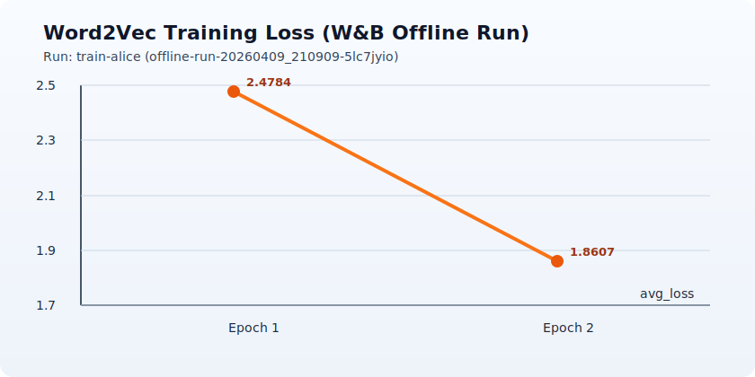

# Word2Vec from Scratch (Skip-gram + Negative Sampling)

A lightweight, pure-Python implementation of Word2Vec training and evaluation on a local text corpus.

This project trains skip-gram embeddings with negative sampling, saves reusable artifacts, and includes optional Weights & Biases (W&B) logging in offline or online mode.



## What this project does

- Trains word embeddings from raw text (`train_word2vec.py`)
- Evaluates embedding quality with lightweight intrinsic metrics (`evaluate_word2vec.py`)
- Writes artifacts you can inspect or reuse in downstream tasks
- Optionally logs runs to W&B

## Repository layout

```text
.
|- train_word2vec.py
|- evaluate_word2vec.py
|- data/
|  |- alice.txt
|- artifacts/
|  |- embeddings.txt
|  |- vocab.txt
|  |- train_metadata.json
|- assets/
|  |- wandb-train-loss.svg
|- word2vec.pdf
```

## Requirements

- Python 3.10+
- Optional: `wandb` for experiment tracking

Install W&B (optional):

```bash
python -m pip install wandb
```

## Quick start

### 1) Train embeddings

```bash
python train_word2vec.py \
  --input data/alice.txt \
  --output artifacts/embeddings.txt \
  --vocab-output artifacts/vocab.txt \
  --metadata-output artifacts/train_metadata.json \
  --dim 40 \
  --window 2 \
  --min-count 5 \
  --epochs 2 \
  --lr 0.03 \
  --neg-samples 5 \
  --max-tokens 30000
```

### 2) Evaluate embeddings

```bash
python evaluate_word2vec.py \
  --input data/alice.txt \
  --embeddings artifacts/embeddings.txt \
  --metadata artifacts/train_metadata.json \
  --window 2 \
  --max-tokens 40000 \
  --sample-pairs 10000 \
  --max-centers 500
```

## Using W&B

### Train with W&B enabled

```bash
python train_word2vec.py \
  --wandb \
  --wandb-project word2vec-local \
  --wandb-run-name train-alice \
  --wandb-mode offline
```

### Evaluate with W&B enabled

```bash
python evaluate_word2vec.py \
  --wandb \
  --wandb-project word2vec-local \
  --wandb-run-name eval-alice \
  --wandb-mode offline
```

### Sync offline runs later (optional)

```bash
wandb sync .wandb/wandb/offline-run-*/
```

## Artifacts

### `artifacts/embeddings.txt`

- Text format with header: `<vocab_size> <embedding_dim>`
- One word vector per line

### `artifacts/vocab.txt`

- Vocabulary list sorted by descending frequency

### `artifacts/train_metadata.json`

- Reproducibility metadata: hyperparameters and dataset stats

## Current run snapshot

From the latest logged training output:

- Epoch 1 average loss: `2.4784`
- Epoch 2 average loss: `1.8607`
- Tokens used: `27,439`
- Vocabulary size: `689`
- Training pairs: `96,998`

Sample nearest neighbors:

- `alice`: `did`, `mouse`, `dare`, `gryphon`, `nonsense`
- `rabbit`: `other`, `door`, `chapter`, `same`, `another`
- `queen`: `king`, `duchess`, `baby`, `whole`, `first`
- `king`: `queen`, `gryphon`, `hearts`, `first`, `duchess`

## Repro tips

- Use `--seed` for deterministic initialization and sampling behavior
- Keep `--max-tokens` fixed when comparing experiments
- Keep `--window`, `--dim`, and `--neg-samples` consistent for fair comparisons

## Notes

- This implementation prioritizes clarity over training speed.
- Training is CPU-based and intentionally minimal (no NumPy/PyTorch dependency).
